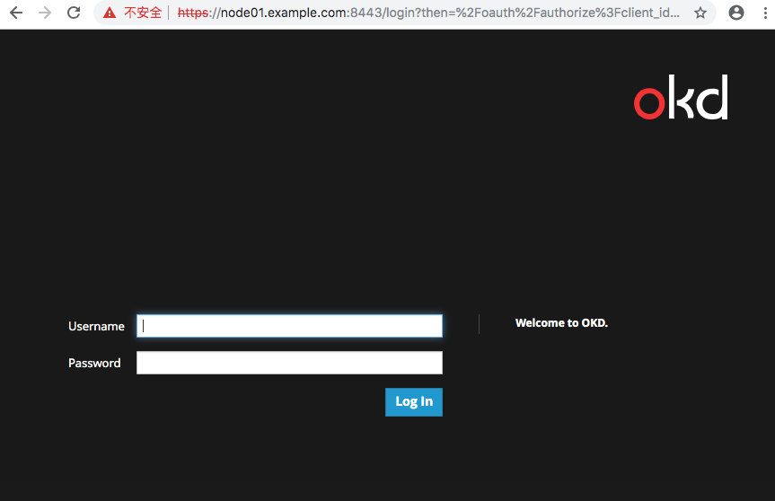
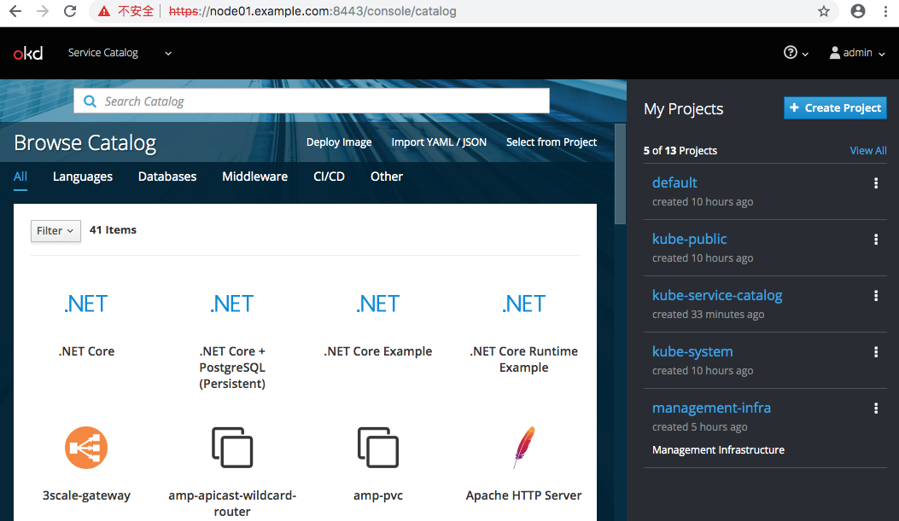

# 安装OpenShift (okd3.11)

本次试验采用3台虚拟机，每台机器即作为node节点又作为master节点使用。
问题最多的是因为镜像下载问题。

## 1.安装前准备

### 1.1 主机划分

| 主机名称 | IP地址 | 系统版本 | 资源配置 |
| ------ | ------ | ------ | ------ |
| node01.example.com | 192.168.0.21 | Centos7.6 | 1C4G |
| node02.example.com | 192.168.0.32 | Centos7.6 | 1C4G |
| node03.example.com | 192.168.0.43 | Centos7.6 | 1C4G |

将上述表格配置添加到/etc/hosts文件中

```
192.168.0.21 node01.example.com
192.168.0.32 node02.example.com 
192.168.0.43 node03.example.com
```

### 1.2 SSH免密交互
此处配置node01能够免密登录其他机器即可，如需所有机器免密则在所有节点执行以下操作。

```
ssh-keygen  #生成秘钥 一路回车
ssh-copy-id node01.example.com   # 输入yes，输入密码。
ssh-copy-id node02.example.com   # 输入yes，输入密码。
ssh-copy-id node03.example.com   # 输入yes，输入密码。
```

### 1.3 更新操作系统组件
我使用的是centos7.3的镜像安装的虚拟机，在这里可以通过以下命令升级操作系统为最新(目前centos7.6)。

```
yum update -y
yum install wget git net-tools bind-utils yum-utils iptables-services bridge-utils bash-completion kexec-tools sos psacct -y

yum -y install docker 
reboot
```

### 1.4 获取安装脚本
使用下面的源安装ansible2.7，2.4版本的不能使用,也不能用2.8版本 建议2.7。

第一种方式（废弃）
```
yum -y install https://dl.fedoraproject.org/pub/epel/epel-release-latest-7.noarch.rpm
sed -i -e "s/^enabled=1/enabled=0/" /etc/yum.repos.d/epel.repo
yum -y --enablerepo=epel install ansible pyOpenSSL
```
第二种方式

```
https://releases.ansible.com/ansible/rpm/release/epel-7-x86_64/
配置官方yum，安装2.7版本ansible/或者直接下载2.7版本的rpm包通过以下方式安装

yum -y install ansible-2.7.8-1.el7.ans.noarch.rpm

```
下载ansible安装的playbook脚本。

```
git clone https://github.com/openshift/openshift-ansible
cd openshift-ansible
git checkout release-3.11     #切换到对应版本的分支
```

### 1.5 下载需要的Image镜像
master节点需要的镜像列表

```
docker.io/openshift/origin-node:v3.11
docker.io/openshift/origin-node:v3.11.0
docker.io/openshift/origin-control-plane:v3.11
docker.io/openshift/origin-control-plane:v3.11.0
docker.io/openshift/origin-pod:v3.11
docker.io/openshift/origin-pod:v3.11.0
docker.io/openshift/origin-deployer:v3.11.0
docker.io/ubuntu:latest
docker.io/openshift/origin-console:v3.11
docker.io/openshift/origin-console:v3.11.0
docker.io/openshift/origin-service-catalog:v3.11.0
docker.io/openshift/origin-web-console:v3.11
docker.io/openshift/origin-web-console:v3.11.0
docker.io/cockpit/kubernetes:latest
docker.io/openshift/prometheus-node-exporter:v0.16.0
quay.io/coreos/kube-rbac-proxy:v0.3.1
quay.io/coreos/etcd:v3.2.22
 
```

node节点需要的镜像列表

```
docker.io/openshift/origin-node:v3.11
docker.io/openshift/origin-node:v3.11.0
docker.io/openshift/origin-haproxy-router:v3.11
docker.io/openshift/origin-haproxy-router:v3.11.0
docker.io/openshift/origin-pod:v3.11.0
docker.io/openshift/origin-deployer:v3.11.0
docker.io/ubuntu:latest
docker.io/openshift/origin-docker-registry:v3.11
docker.io/openshift/origin-docker-registry:v3.11.0
quay.io/coreos/cluster-monitoring-operator:v0.1.1
quay.io/coreos/prometheus-config-reloader:v0.23.2
quay.io/coreos/prometheus-operator:v0.23.2
docker.io/openshift/prometheus-alertmanager:v0.15.2
docker.io/openshift/prometheus-node-exporter:v0.16.0
docker.io/openshift/prometheus:v2.3.2
docker.io/grafana/grafana:5.2.1
quay.io/coreos/kube-rbac-proxy:v0.3.1
quay.io/coreos/kube-state-metrics:v1.3.1
docker.io/openshift/oauth-proxy:v1.1.0
quay.io/coreos/configmap-reload:v0.0.1
```


## 2. 开始安装集群

### 2.1 准备部署的hosts文件

```
[root@master ~]# cat /etc/ansible/hosts
[OSEv3:children]
masters
nodes
etcd

[OSEv3:vars]
ansible_ssh_user=root
openshift_release="3.11"
openshift_deployment_type=origin
#因采用虚拟机部署学习 配置此选项跳过主机硬件信息检查
openshift_disable_check=disk_availability,docker_storage,memory_availability,docker_image_availability
openshift_master_identity_providers=[{'name':'htpasswd_auth','login':'true','challenge':'true','kind':'HTPasswdPasswordIdentityProvider',}]

openshift_deployment_type=origin
os_firewall_use_firewalld=true
openshift_metrics_install_metrics=false
openshift_logging_install_logging=false
ansible_service_broker_install=false
openshift_enable_service_catalog=false

[masters]
node01.example.com
node02.example.com
node03.example.com

[etcd]
node01.example.com
node02.example.com
node03.example.com

[nodes]
node01.example.com openshift_node_group_name='node-config-master'
node01.example.com openshift_node_group_name='node-config-compute'
node02.example.com openshift_node_group_name='node-config-master'
node02.example.com openshift_node_group_name='node-config-compute'
node03.example.com openshift_node_group_name='node-config-master'
node03.example.com openshift_node_group_name='node-config-compute'

```


### 2.2 开始部署

```
ansible-playbook openshift-ansible/playbooks/prerequisites.yml   #执行安装前检查

ansible-playbook openshift-ansible/playbooks/deploy_cluster.yml   #真正的安装集群

#会自动在/etc/yum.repos.d中增加一个openshift的yum源文件
#替换当中的地址
%s/mirror.centos.org/mirrors.tuna.tsinghua.edu.cn/g


``` 


### 2.3 部署测试
创建管理员账号

```
htpasswd -b /etc/origin/master/htpasswd admin admin
oc login -u system:admin
oc adm policy add-cluster-role-to-user cluster-admin admin
```

登录页面


首页



## FAQ

### 1.执行安装monitoring的时候出现错误
通过oc get pod -n openshift-monitoring 查看到pod的状态是镜像错误，需要下载prometheus-operator:v0.23.2失败。

```
docker pull tripleorocky/coreos-prometheus-operator:v0.23.2

docker tag tripleorocky/coreos-prometheus-operator:v0.23.2 quay.io/coreos/prometheus-operator:v0.23.2
```

如果安装的时候没有给node打上对应的label标记，也会出现调度错误。需要的label,所有节点需要执行。（具体的label可以通过oc edit pod获取）

```
oc label node node01.example.com node-role.kubernetes.io/infra=true
```


### 2. 执行安装web-console出现错误
跟上面的问题类似，这次是label问题（调度失败），需要给节点打上对应的label标记。

```
 oc label node node01.example.com node-role.kubernetes.io/master=true
```

### 3. service-catalog失败

```
  Normal   Pulled     18m   kubelet, node01.example.com  Container image "docker.io/openshift/origin-service-catalog:v3.11.0" al
ready present on machine  Normal   Created    18m   kubelet, node01.example.com  Created container
  Normal   Started    18m   kubelet, node01.example.com  Started container
  Warning  Unhealthy  15m   kubelet, node01.example.com  Liveness probe failed: Get https://10.129.0.11:6443/healthz: net/http: 
request canceled (Client.Timeout exceeded while awaiting headers)
```

删除pod重新创建解决此问题。

### 4.导出镜像
将镜像名称存放到images.txt文件中

```
[root@node01 ~]# docker images | awk '{print $1":"$2}'
REPOSITORY:TAG
quay.io/coreos/cluster-monitoring-operator:v0.1.1
docker.io/openshift/origin-node:v3.11.0
docker.io/openshift/origin-control-plane:v3.11
docker.io/openshift/origin-control-plane:v3.11.0
docker.io/openshift/origin-haproxy-router:v3.11.0
docker.io/openshift/origin-deployer:v3.11.0
docker.io/openshift/origin-template-service-broker:v3.11.0
docker.io/openshift/origin-pod:v3.11.0
docker.io/openshift/origin-docker-registry:v3.11.0
docker.io/openshift/origin-console:v3.11.0
docker.io/openshift/origin-service-catalog:v3.11.0
docker.io/openshift/origin-web-console:v3.11.0
docker.io/tripleorocky/coreos-prometheus-operator:v0.23.2
quay.io/coreos/prometheus-operator:v0.23.2
docker.io/grafana/grafana:5.2.1
quay.io/coreos/etcd:v3.2.22
docker.io/openshift/oauth-proxy:v1.1.0
```

导出

```
for image in `cat images.txt`
do 
    zipname=`echo ${image} | awk -F / '{print $3}'`
    docker save ${image} > images/${zipname}.tar.gz
done

```

### 5.metric
```
TASK [openshift_metrics : generate htpasswd file for hawkular metrics] *********************************************************************
fatal: [node01.example.com -> localhost]: FAILED! => {"changed": false, "msg": "This module requires the passlib Python library"}
        to retry, use: --limit @/root/openshift-ansible/playbooks/deploy_cluster.retry
        
        
[root@node01 ~]# pip install passlib
Collecting passlib
  Downloading https://files.pythonhosted.org/packages/ee/a7/d6d238d927df355d4e4e000670342ca4705a72f0bf694027cf67d9bcf5af/passlib-1.7.1-py2.py3-none-any.whl (498kB)
    100% |████████████████████████████████| 501kB 293kB/s 
Installing collected packages: passlib
Successfully installed passlib-1.7.1
You are using pip version 8.1.2, however version 19.0.3 is available.

ansible-playbook openshift-ansible/playbooks/openshift-metrics/config.yml
        
```
